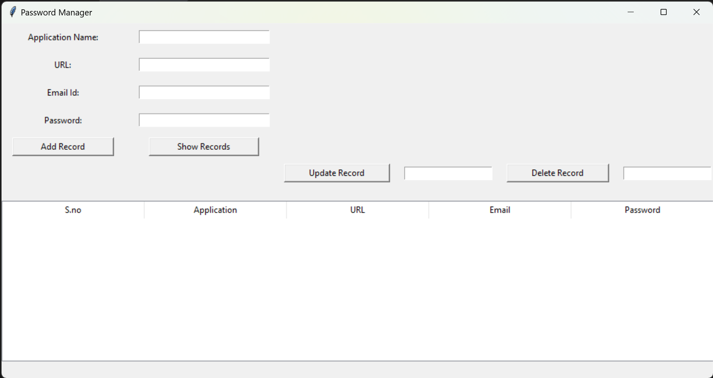
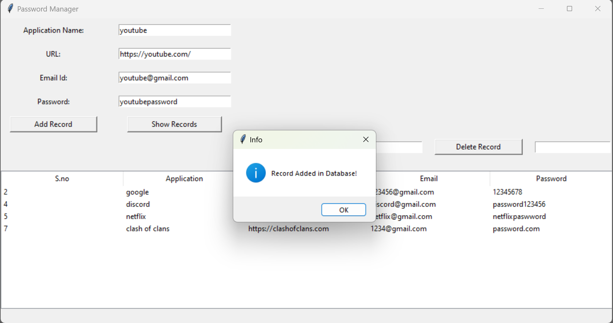
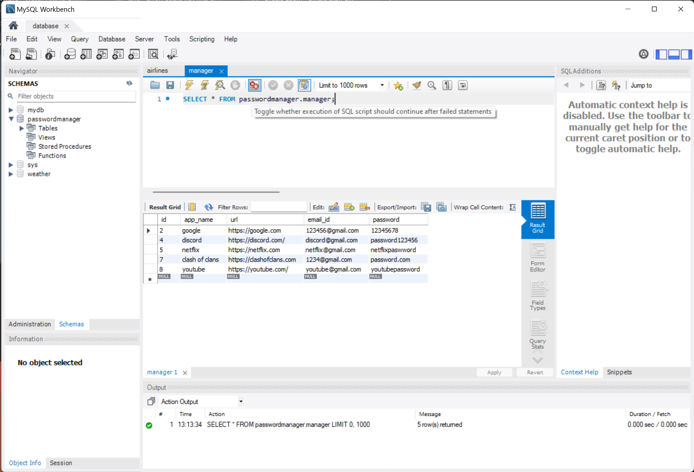

## Password-manager
Password manager made using Python and Mysql database for the storage of the passwords

## Screenshots




## How to run:

You can try this code by yourself by following the steps:
- clone this repo or download it as zip file
- you are gonna need 2 thing, python and mySQL
- install mysql connector and tkinter for python:
  ```
  pip install mysql-connector-python
  ```
  ```
  pip install tkinter
  ```
- change the password and database name(if you use any other names that is) in lines 15, 33, 63, 80, 129 and 150
- note: this code will create the table for you if it does not exist, so you need just to create the database(schema)

## Contributing:

Pull requests are welcome. For major changes, please open an issue first
to discuss what you would like to change.

Please make sure to update tests as appropriate.
